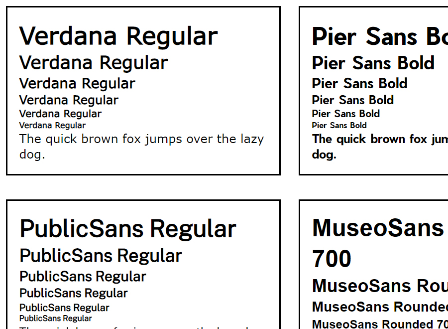

# Font Component

### Aug 6 2022
Added some RobotoMono fonts.

### Aug first wekk 2022
This is a small project I started in August 2022 and finished within the first week. I collected some fonts on https://www.dafont.com/ and converted them into webfonts.

To execute, install packages within 'package.json' one by one to avoid errors, then run 'npm run startDev' for development on your terminal.

Live Site URL: [Live Demo](https://kennyestrella-snippets-font-component.netlify.app/)

### Used tools & technologies
  